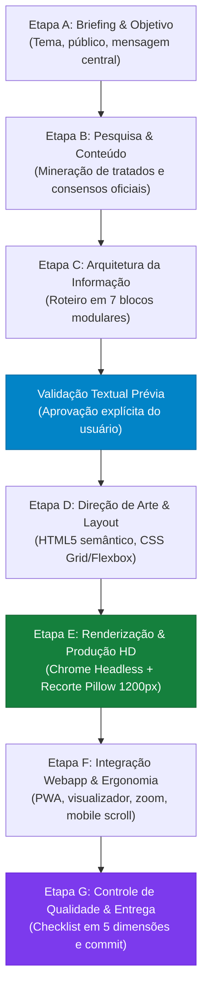

# Fluxo de Trabalho Operacional — Infográficos Profissionais

Este documento detalha o processo metodológico completo, da análise do briefing à entrega final e publicação do infográfico. Cada etapa estabelece objetivos claros, critérios de transição e procedimentos técnicos testados e validados no projeto.

---

## Visão Geral do Ciclo de Criação



---

## Etapa A — Briefing e Definição do Objetivo

### 1. Levantamento de Requisitos Essenciais
Antes de redigir qualquer rascunho visual, estabeleça:
- **Tema Clínico Específico**: Qual é a patologia, agravo ou processo de decisão?
- **Público-Alvo**: Estudantes de medicina, médicos residentes, generalistas ou especialistas à beira do leito.
- **Objetivo da Comunicação**: Diagnóstico rápido, triagem de gravidade em pronto-socorro, escalonamento terapêutico ou prevenção de iatrogenias.
- **Contexto de Utilização**: Consulta ágil em smartphone (plantão médico), tela desktop de estudo ou material de impressão/download HD.
- **Restrições e Requisitos Mandatórios**:
  - Orientação estritamente vertical (retrato).
  - Texto legível sem caracteres miniaturizados.
  - Fidelidade a consensos oficiais (ex.: SBP 2024, FEBRASGO 2ª Edição, PCDT/Ministério da Saúde).

> [!TIP]
> **Eficiência no Briefing**: Se o pedido do usuário já contiver o tema e a diretriz, avance diretamente para a pesquisa e organização sem questionários redundantes. Faça perguntas pontuais apenas se houver conflito de diretrizes ou ausência de escopo claro.

---

## Etapa B — Pesquisa e Organização do Conteúdo

### 1. Critérios de Rigor e Fontes
- **Prioridade Absoluta**: Tratados oficiais de referência disponíveis no projeto (ex.: *Tratado de Pediatria SBP 6ª Edição 2024*, *Tratado de Ginecologia FEBRASGO 2ª Edição*) ou consensos consolidados.
- **Regra Anti-Alucinação**: É proibido inventar valores de corte, intervalos posológicos, faixas de saturação de oxigênio ou percentuais epidemiológicos. Se um dado não constar na fonte de referência, deve ser explicitamente sinalizado.
- **Separação Estruturada**:
  - **Fatos Fisiopatológicos**: O mecanismo celular/mecânico que causa a queixa.
  - **Semiologia e Red Flags**: O que o exame físico e a história revelam de imediato.
  - **Escore Numérico Objetivo**: Parâmetros de estratificação quantitativa validados.
  - **Conduta Sequencial**: Ações escalonadas por gravidade (Leve, Moderada, Grave).
  - **Prevenção Quaternária**: O que a evidência recomenda expressamente NÃO fazer (*Choosing Wisely*).

---

## Etapa C — Arquitetura da Informação & Planejamento Textual

### 1. Estruturação em 7 Blocos Modulares
A informação deve ser decomposta em uma narrativa vertical contínua:
1. **Bloco 1 — Definição Operacional & Epidemiologia**: Conceito definitivo na voz da diretriz, faixa etária crítica e agente etiológico prevalente.
2. **Bloco 2 — Fisiopatologia em 3 Etapas**: Tríade etiopatogênica e callout explicativo do "porquê" as terapias convencionais funcionam ou falham.
3. **Bloco 3 — Semiologia em 4 Eixos & Sinais de Alarme**: Cronologia típica, ausculta/mecânica, ingesta/hidratação e Red Flags com alerta vermelho.
4. **Bloco 4 — Escore Clínico Estruturado**: Tabela com todos os parâmetros pontuados e caixas inferiores de estratificação por faixas de corte.
5. **Bloco 5 — Algoritmo Decisório Sequencial em 3 Vias**: Triagem direta com Via Verde (Ambulatorial), Via Amarela (Enfermaria) e Via Vermelha (UTI/Suporte Avançado).
6. **Bloco 6 — Prevenção Quaternária (*Choosing Wisely*)**: Lista com justificativa de condutas não indicadas rotineiramente.
7. **Bloco 7 — Profilaxia, Seguimento & Fonte Bibliográfica**: Indicações preventivas, imunobiológicos e citação formal completa.

### 2. Validação Prévia Obrigatória (Aprovação do Usuário)
Todo o conteúdo dos 7 blocos deve ser apresentado ao usuário em documento estruturado (`implementation_plan.md` ou plano equivalente) antes da fase gráfica. A renderização visual só tem início após a aprovação formal do texto planejado.

---

## Etapa D — Direção de Arte e Construção em HTML5/CSS

### 1. Desenvolvimento do Layout
- **Arquivo de Produção**: Criado em diretório de trabalho (ex.: `scratch/infografico_[slug]_vertical.html`).
- **Dimensões e Viewport**:
  - Largura fixa do container: `1200px`.
  - Altura: Flexível (`auto`), calculada pelo fluxo natural dos componentes.
  - Padding lateral: `40px` a `50px`.
- **Camadas de Estilo**:
  - Tipografia: `@import Plus Jakarta Sans` (pesos 600, 700, 800, 900).
  - Background editorial: `#edf6f5` com textura de `radial-gradient` (#cbdad8 em 32×32px).
  - Cartões brancos com sombras suaves de elevação (`box-shadow: 0 8px 24px rgba(15, 23, 42, 0.04)`).
  - Numeração ordinal nos blocos (1 a 7).
  - Cores semafóricas para triagem clínica.

---

## Etapa E — Renderização Automatizada em Alta Resolução

### 1. Execução via Chrome Headless
A renderização em imagem não depende de ferramentas gráficas manuais externas. É realizada diretamente pelo motor Chromium do ambiente:

```bash
google-chrome \
  --headless=new \
  --disable-gpu \
  --no-sandbox \
  --window-size=1200,6000 \
  --virtual-time-budget=6000 \
  --screenshot="infografico_bruto.png" \
  "file:///caminho/para/infografico_template.html"
```

### 2. Medição Precisa e Recorte Automatizado com Python/Pillow
Para evitar barras pretas, bordas cortadas ou espaços em branco excessivos no final da imagem:
1. Um script lê a altura exata da caixa `.poster-container` no DOM via Chrome headless ou calcula os limites úteis.
2. O script Python (PIL) abre `infografico_bruto.png`, recorta na coordenada `(0, 0, 1200, altura_real)` e salva em PNG otimizado em `imagens/`.

```python
from PIL import Image

img = Image.open("infografico_bruto.png")
# Recorte na largura exata de 1200 e na altura exata renderizada
cropped = img.crop((0, 0, 1200, target_height))
cropped.save("imagens/infografico-tema.png", optimize=True)
```

---

## Etapa F — Integração no Webapp e Ergonomia Mobile

### 1. Interface de Exibição
O infográfico deve ser integrado ao módulo clínico com:
- **Alternador de Modo**: Botão para alternar entre `📊 Infográfico NotebookLM (HD)` e `📐 Fluxograma SVG Clássico`.
- **Barra de Ações**:
  - `Zoom +` (+15% de escala incremental)
  - `Zoom −` (-15% de escala incremental)
  - `100%` (Restauração da escala original)
  - `↔ Expandir / ⇥ Reduzir` (Desktop Wide Mode expandindo até 1200px)
  - `🔍 Abrir em Tela Cheia` (Link direto para a imagem PNG em nova aba)
  - `💾 Baixar Imagem HD` (Link com atributo `download` para o arquivo em altíssima definição)

### 2. Regra Mandatória para Mobile (`css/main.css`)
Para prevenir problemas de rolagem no smartphone:
```css
@media (max-width: 768px) {
  .flowchart-img-container:has(.infographic-mode) {
    max-height: none !important;
    overflow-y: visible !important;
    contain: none !important;
    padding: 8px 0 !important;
  }
  #bva-expand-btn {
    display: none !important; /* Em mobile a largura já é 100% */
  }
}
```

---

## Etapa G — Revisão, Refinamento e Publicação

### 1. Testes Automatizados de Visualização
- Capturar screenshot em viewport **Desktop (1440×900)**.
- Capturar screenshot em viewport **Mobile (390×844, DPR 2)**.
- Verificar contraste no **Modo Noturno (Dark Mode)**.
- Inspecionar diretamente a nitidez visual e ortografia.

### 2. Atualização de Cache e Publicação
- Se o projeto utilizar Service Worker (PWA), incrementar o `CACHE_NAME` (ex.: de `v1` para `v2`) em `sw.js` para garantir que dispositivos móveis descartem o cache antigo.
- Registrar commit formal no Git e realizar push para o repositório remoto.
