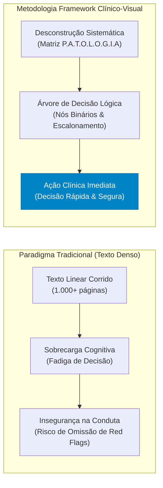
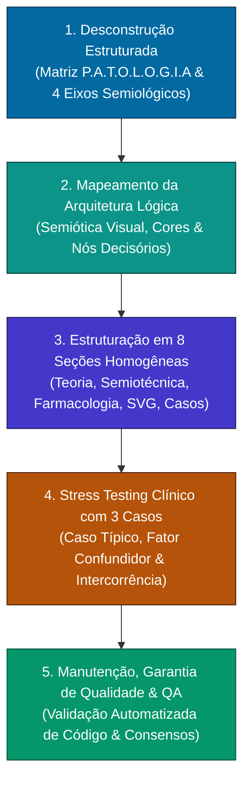
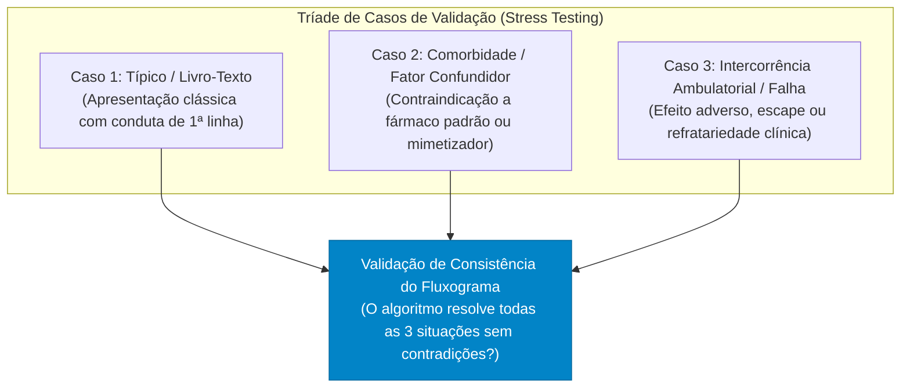
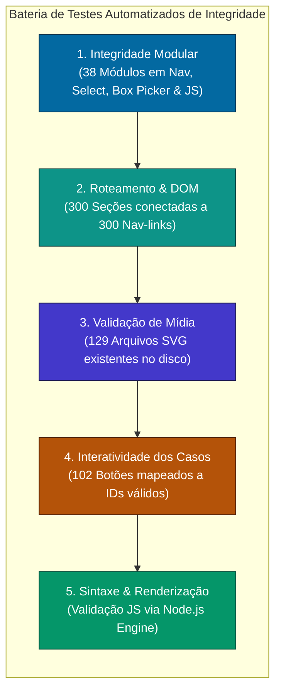

# Método de Construção de Fluxogramas Clínicos & Engenharia de Decisão Médica (Framework Clínico-Visual)

> **Destinado a:** Estudantes de Medicina, Médicos Residentes, Médicos Generalistas e Especialistas.  
> **Objetivo:** Transformar diretrizes densas, tratados de referência (Tratado de Ginecologia FEBRASGO - 2ª Edição) e consensos internacionais (OMS, FIGO, ESHRE, ACOG, IUGA, ICS, SBM, CDC, IFCPC, NAMS/IMS, Endocrine Society) em algoritmos de decisão clínica rápidos, memorizáveis, seguros e aplicáveis à beira do leito e no ambulatório.  
> **Status do Portal:** 38 Módulos Ativos | 300 Seções Clínicas Estruturadas | 129 Fluxogramas Vetoriais SVG | 102 Casos Clínicos Simulados Interativos | 150+ Tabelas e Prescrições Especializadas.

---

## 1. Fundamentação Teórica: Por que Aprender e Decidir por Fluxogramas Clínicos?

A formação e a prática médica contemporânea enfrentam o desafio da **sobrecarga cognitiva** e da **velocidade na tomada de decisão sob incerteza**. Na transição do ciclo básico para o internato e a residência médica, o estudante depara-se com a necessidade urgente de converter o **conhecimento declarativo** (memorização estática de listas, classificações e fisiopatologia) em **conhecimento procedimental** (ação deliberada e sequencial: *o que perguntar primeiro, o que examinar, qual exame solicitar e qual prescrição emitir*).



### Comparativo Metodológico: Aprendizado Tradicional vs. Framework Clínico-Visual

| Dimensão Clínica | Paradigma Tradicional (Texto Corrido) | Framework Clínico-Visual (Fluxograma Decisório) |
| :--- | :--- | :--- |
| **Processamento Cognitivo** | Passivo e linear; detalhes secundários competem com informações vitais. | Ativo e hierárquico; simula o processo mental de *hipótese → teste → conduta*. |
| **Hierarquização de Gravidade** | *Red Flags* diluídos no meio de longos parágrafos explicativos. | *Red Flags* destacados em nós de alerta no topo da árvore de decisão. |
| **Tempo de Consulta** | Inviável consultar tratados durante o atendimento de 15 a 20 minutos. | Consulta ultra-rápida (< 15 segundos) para guiar conduta e dosagens. |
| **Raciocínio Diagnóstico** | Tendência ao fechamento diagnóstico prematuro e viés de ancoragem. | Avaliação sequencial obrigatória com critérios objetivos de inclusão/exclusão. |
| **Prescrição & Posologia** | Doses e vias espalhadas no texto ou omitidas na teoria pura. | Prescrições padronizadas com fármaco, dose, via, intervalo, duração e contraindicações. |
| **Fixação & Retenção** | Rápida curva de esquecimento da memória de curto prazo. | Memória espacial e visual duradoura associada a nós cromáticos e ramificações. |

---

## 2. As 5 Etapas do Framework Clínico-Visual

O desenvolvimento de cada módulo do portal segue rigorosamente cinco etapas encadeadas, desde a mineração bibliográfica primária até a validação com casos simulados:



---

### ETAPA 1: Desconstrução Estruturada da Fonte (Mineração de Dados)

Ao analisar um capítulo do Tratado FEBRASGO, diretriz ministerial (PCDT) ou consenso internacional, a equipe não realiza um mero resumo linear. Aplica-se a **Matriz P.A.T.O.L.O.G.I.A**:

```
P  -  Porta de Entrada (Queixa Principal na voz da paciente)
A  -  Anamnese Dirigida (Roteiro Semiológico em 4 Eixos)
T  -  Triagem de Fatores Extrínsecos, Iatrogenias & Comorbidades
O  -  Objetivação no Exame Físico (Semiotécnica sistematizada)
L  -  Laboratório & Imagem Racional (Exames de alto rendimento)
O  -  Organização Diagnóstica & Classificações Oficiais
G  -  Graduação Terapêutica (Escalonamento em 1ª Linha, 2ª Linha, Cirurgia)
I  -  Interações, Contraindicações Absolutas & Alertas de Segurança
A  -  Avaliação de Resposta & Prazos de Seguimento (Follow-up)
```

#### Detalhamento Operacional da Matriz P.A.T.O.L.O.G.I.A:

1. **P - Porta de Entrada (Queixa Principal / Motivo da Consulta):**
   * Expressão direta do sintoma conforme trazido pela mulher ao consultório ou emergência (ex.: *"minha menstruação não para há 15 dias"*, *"palpei um caroço duro na mama"*, *"não consigo urinar sem sentir que a bexiga caiu"*).
2. **A - Anamnese Dirigida (4 Eixos Semiológicos Padronizados):**
   * Toda queixa clínica deve ser decomposta em 4 dimensões obrigatórias:
     * **1. Frequência & Periodicidade:** Ritmo do sintoma (cíclico perimenstrual, contínuo, pós-coital, paroxístico).
     * **2. Intensidade & Gravidade Objetiva:** Mensuração por instrumentos validados (EVA 0–10 para dor, quantificação de trocas de absorventes e presença de coágulos > 2,5 cm para sangramento, escore ICIQ-SF para incontinência, índice de Ferriman-Gallwey para hirsutismo).
     * **3. Duração & Evolução:** Tempo de instalação (agudo vs. crônico), dias por ciclo e persistência em meses/anos.
     * **4. Sintomas Associados & Alertas Vermelhos (*Red Flags*):** Febre, instabilidade hemodinâmica, repercussão sistêmica (anemia ferropriva severa), sintomas de compartimentos adjacentes (dispareunia, disquezia, tenesmo) e sinais de alerta oncológico (perda ponderal inexplicada, sangramento na pós-menopausa).
3. **T - Triagem de Fatores Extrínsecos, Iatrogenias & Comorbidades:**
   * Uso de medicações diárias (antidepressivos ISRS, anticoagulantes, tamoxifeno, agonistas/antagonistas hormonais).
   * Comorbidades de impacto vascular/oncológico: HAS, diabetes, tabagismo, TEV prévio, enxaqueca com aura, mutações BRCA1/BRCA2 ou Síndrome de Lynch.
   * Aplicação dos Critérios Médicos de Elegibilidade da OMS / FEBRASGO (Categorias 1 a 4).
4. **O - Objetivação no Exame Físico (Semiotécnica Rigorosa):**
   * Ectoscopia e sinais vitais (PA, pulso, IMC, palidez cutaneomucosa).
   * Mamas e cadeias ganglionares (inspeção estática, manobras dinâmicas, palpação de Bloodgood, expressão papilar e palpação de linfonodos axilares e supraclaviculares).
   * Abdome ginecológico (inspeção, RHA prévios, palpação superficial/profunda, sinal de Blumberg, MacBurney, Giordano e semicírculo de Skoda para ascite vs. cisto).
   * Genitais externos, glândulas de Skene/Bartholin e assoalho pélvico (Escala de Oxford, POP-Q e manobra de Valsalva).
   * Exame especular (introdução a 45° oblíquo sem lubrificantes nocivos, exposição do colo, Schiller, Papanicolaou e coletas bacteriológicas).
   * Toque vaginal bimanual e retovaginal (consistência cervical, sinal de Frenkel/Proust, volume uterino, anexos e pesquisa de endometriose profunda no septo retovaginal).
5. **L - Laboratório & Imagem Racional:**
   * Solicitação sequencial e justificada: o que realmente altera a conduta imediata.
   * Regra de ouro: $\beta$-hCG quantitativo imediato em qualquer mulher em idade fértil com dor ou sangramento anormal.
   * Mapeamento imagético: Ultrassonografia Transvaginal (com preparo intestinal na endometriose, critérios MUSA na adenomiose e regras IOTA nos anexos), Mamografia bilateral (BI-RADS® 6ª edição), Histerossalpingografia (Prova de Cotte) e Ressonância Magnética com contraste quando indicada.
   * Prevenção de armadilhas laboratoriais (macroprolactina via precipitação com PEG; efeito gancho com diluição 1:100; teste de Schiller falso-negativo).
6. **O - Organização Diagnóstica & Classificações Oficiais:**
   * Enquadramento estrito nas taxonomias adotadas pela FEBRASGO e consensos mundiais:
     * Sangramento Uterino Anormal: **FIGO PALM-COEIN** (2018).
     * Síndrome dos Ovários Policísticos: **Critérios de Rotterdam / Teede 2023** (Fenótipos A a D).
     * Climatério e Menopausa: **Critérios STRAW+10** (Estádios -5 a +2).
     * Prolapso Genital: **Estadiamento POP-Q** (Estádios 0 a IV).
     * Lesões Precursoras de Colo: **Nomenclatura Colposcópica IFCPC 2011** (ZT 1 a 3; achados menores vs. maiores).
     * Mastologia: **BI-RADS® ACR** (Categorias 0 a 6) e Subtipos Moleculares (Luminal A, Luminal B, HER2, Triplo-Negativo).
     * Oncologia Ginecológica: **Estadiamentos FIGO 2018/2021/2023** (Colo, Ovário, Endométrio e Vulva).
7. **G - Graduação Terapêutica (Escalonamento por Linhas):**
   * **1ª Linha:** Conduta padrão-ouro baseada em ensaios clínicos randomizados, diretrizes de alta recomendação e maior sobrevida global / menor índice de Pearl.
   * **2ª Linha:** Alternativas medicamentosas para pacientes com contraindicações específicas, intolerância ou falha de resposta terapêutica.
   * **Abordagem Cirúrgica & Intervencionista:** Cirurgia conservadora minimamente invasiva (histeroscopia, laparoscopia) vs. procedimentos radicais definitivos.
8. **I - Interações & Contraindicações Absolutas:**
   * Alertas explícitos de segurança médica:
     * Categoria 4 da OMS (risco inaceitável à saúde).
     * Contraindicações absolutas à terapia estrogênica (câncer de mama atual, TEV agudo, hepatopatia descompensada, enxaqueca com aura, sangramento genital de causa desconhecida).
     * Interações farmacocinéticas severas (inibidores do CYP2D6 como fluoxetina diminuindo ativação de tamoxifeno; indutores do CYP3A4 reduzindo níveis de contraceptivos orais).
9. **A - Avaliação de Resposta (Follow-up):**
   * Cronograma de retorno e metas terapêuticas mensuráveis (ex.: controle de sangramento em 3 meses pós-DIU; mamografia anual; reavaliação de densitometria óssea e perfil lipídico; acompanhamento colposcópico semestral).

---

### ETAPA 2: Mapeamento da Arquitetura Lógica e Semiótica Visual

A tradução clínica para representação gráfica vetorial segue uma gramática visual padronizada de nós e arestas:

```
[Nó de Entrada / Queixa] (Oval Azul Escuro - #0369a1)
       │
       ▼
<Nó de Decisão / Pergunta Binária> (Losango Âmbar - #d97706)
  ├── SIM ──► [Nó de Red Flag / Urgência] (Retângulo Vermelho - #b91c1c)
  └── NÃO ──► [Nó de Propedêutica Racional] (Retângulo Ciano - #0891b2)
                     │
                     ▼
              [Nó de Prescrição / Desfecho] (Retângulo Arredondado Verde - #059669)
                     │
                     ▼
              [Nó de Intercorrência / Falha] (Retângulo Roxo - #7c3aed)
```

| Elemento Semiótico | Geometria & Cor Padrão | Função Clínica no Algoritmo | Exemplo Prático |
| :--- | :--- | :--- | :--- |
| **Nó de Entrada** | Oval • Azul Escuro (`#0369a1`) | Ponto de partida, motivo da consulta ou triagem. | `Mulher com queixa de SUA na menacme` |
| **Nó de Decisão** | Losango • Âmbar (`#d97706`) | Ponto de bifurcação lógica binária (Sim/Não) ou categórica. | `Estabilidade hemodinâmica presente?` |
| **Nó de Red Flag / Alerta** | Retângulo • Vermelho Vivo (`#b91c1c`) | Critério de exclusão mandatória, alarme oncológico ou urgência. | `Instável: Volume + Ác. Tranexâmico IV + Foley` |
| **Nó de Propedêutica** | Retângulo • Ciano (`#0891b2`) | Exame laboratorial ou de imagem de alto rendimento. | `Solicitar USTV + Ferritina + Hemograma` |
| **Nó de Prescrição / Desfecho** | Ret. Arredondado • Verde (`#059669`) | Conduta terapêutica resolutiva com posologia e via. | `SIU-LNG 52 mg ou Ácido Tranexâmico 1g 8/8h` |
| **Nó de Intercorrência** | Retângulo • Roxo (`#7c3aed`) | Manejo de efeitos colaterais, escape ou falha após prazo. | `Se spotting > 3 meses: Ácido Mefenâmico 500mg` |

---

### ETAPA 3: A Arquitetura Estrutural dos Módulos Clínicos (O Padrão das 8 Seções)

Para manter a consistência cognitiva em todos os 38 módulos do portal, cada tema é estruturado em uma sequência homogênea de **8 seções clínicas**:

```
├── Seção 1: Visão Geral Teórica, Fisiopatologia & Epidemiologia FEBRASGO
├── Seção 2: Roteiro Semiológico & Propedêutica Inicial
├── Seção 3: Diagnóstico Diferencial & Estratificação de Risco
├── Seção 4: Classificações Clínicas Oficiais & Critérios de Gravidade
├── Seção 5: Abordagem Farmacológica & Escalonamento de 1ª e 2ª Linhas
├── Seção 6: Abordagem Cirúrgica, Técnicas Minimamente Invasivas & Emergências
├── Seção 7: Algoritmos Visuais & Fluxogramas Vetoriais SVG (com Zoom Interativo)
└── Seção 8: Tabelas Clínicas Especializadas, Prescrições Práticas & Casos Clínicos Simulados
```

Essa padronização garante que o estudante ou médico saiba exatamente onde encontrar cada dado em qualquer módulo, seja ao estudar fisiologia menstrual, seja ao conduzir um abdome agudo cirúrgico no plantão.

---

### ETAPA 4: Validação por Casos Clínicos Simulados (*Stress Testing* Clínico)

Nenhum fluxograma é disponibilizado no portal sem antes ser submetido ao teste de estresse de raciocínio clínico através da **Tríade de Casos Simulados**:



#### Protocolo Interativo do Caso Clínico:
1. **História Clínica Completa:** Idade, paridade, queixa principal, tempo de evolução, antecedentes patológicos e gineco-obstétricos.
2. **Exame Físico & Complementares:** Dados vitais, achados de inspeção/toque e laudos de exames laboratoriais ou de imagem.
3. **Pergunta Decisória Condensada:** Formulada para desafiar o julgamento clínico imediato.
4. **Card de Revelação Interativa (`toggleCaseFeedback`):** O estudante clica para expandir a solução comentada, contendo:
   * **Diagnóstico Correto Fundamentado.**
   * **Conduta Imediata Passo a Passo.**
   * **Prescrição Completa com Posologia e Duração.**
   * **Justificativa Clínica baseada nas diretrizes FEBRASGO e no fluxograma correspondente.**

---

### ETAPA 5: Manutenção, Atualização Contínua e Graus de Evidência

A medicina baseada em evidências é dinâmica. A manutenção dos módulos adota a taxonomia do **Oxford Centre for Evidence-Based Medicine (CEBM)** e do sistema **GRADE**:
* Atualização prioritária quando há revisão de PCDT do Ministério da Saúde, novas diretrizes da FEBRASGO ou alertas de farmacovigilância da ANVISA/FDA.
* Inclusão formal de referências com capítulo, edição e ano em cada seção do portal.

---

## 3. Catálogo de Domínios Clínicos do Portal (38 Módulos Consolidados)

A tabela abaixo sintetiza a aplicação prática da metodologia nos **38 módulos** do portal, categorizados por grandes áreas de atuação:

```
┌─────────────────────────────────────────────────────────────────────────────┐
│                   PORTAL DE FLUXOGRAMAS MÉDICOS - 38 MÓDULOS                │
├───────────────────────┬─────────────────────────┬───────────────────────────┤
│ Ginecologia Geral     │ Oncologia Ginecológica  │ Endocrinologia Ginecol.   │
│ • DSF (Cap. 10-12)    │ • Mama (Cap. 83-86)     │ • SOP (Cap. 42-43)        │
│ • SUA (Cap. 20-21, 45)│ • Colo (Cap. 13-14, 79) │ • Climatério (Cap. 56-60) │
│ • LARCs (Cap. 70, 74) │ • Ovário (Cap. 37, 81)  │ • TRH Avançada (Cap. 47)  │
│ • Mioma (Cap. 32)     │ • Endométrio (Cap. 80)  │ • Amenorreias (Cap. 41)   │
│ • Pólipos (Cap. 33)   │ • Câncer Vulva (Cap. 78)│ • Fisiologia (Cap. 1-3)   │
│ • Contracepção (70-76)│                         │ • Prolactina (Cap. 44)    │
│ • Exame Físico (Cap.4)│                         │ • IOP (Cap. 46)           │
├───────────────────────┼─────────────────────────┼───────────────────────────┤
│ Infecção & Urgência   │ Uroginecologia & Assoalho│ Dor & Reprodução          │
│ • Infecções (Cap. 26) │ • POP (Cap. 68)         │ • Infertilidade (Cap. 48) │
│ • DIP (Cap. 28)       │ • Incontinência (63-65) │ • Endometriose (Cap. 35)  │
│ • Abdome Agudo (37-39)│ • Urocomplexa (66-69)   │ • Adenomiose (Cap. 34)    │
│ • Violência (Cap. 40) │                         │ • Dor Pélvica (Cap. 30-36)│
│                       │                         │ • SPM/TDPM (Cap. 31)      │
│                       │                         │ • PGR & SAAF (Cap. 53-61) │
├───────────────────────┴─────────────────────────┴───────────────────────────┤
│ Populações Especiais, Anatomia & Propedêutica                               │
│ • Mama Benigna (Cap. 82)        • Vulva Benigna (Cap. 38, 77)               │
│ • Infância & DDS (Cap. 15, 20)  • Saúde Integral / LGBTQIAPN+ (Cap. 4-9)    │
│ • Anatomia & CMI (Cap. 1-3, 69) • Método do Fluxograma (Framework FEBRASGO) │
└─────────────────────────────────────────────────────────────────────────────┘
```

---

## 4. Metodologia de Engenharia Web, Mobile-First & PWA

O portal foi concebido sob princípios estritos de **Engenharia de Software de Alto Rendimento para Saúde Digital**, garantindo máxima fluidez, estabilidade operacional e compatibilidade multiplataforma.

### 4.1. Filosofia de Zero Dependências Externas (*Zero Dependencies*)
* **Vanilla Web Stack:** Construído 100% em HTML5 semântico, CSS3 moderno com variáveis customizadas (`:root`) e JavaScript modular vanilla em thread de renderização síncrona otimizada.
* **Isenção de Frameworks Pesados:** A ausência de bibliotecas volumosas (React, Angular, Vue) elimina custos de hidratação no cliente, tempos de inicialização de interpretador (*parse/compile overhead*) e riscos de descontinuidade de dependências (*breaking changes* de pacotes npm).
* **Velocidade Bruta:** O portal de 1,78 MB abre instantaneamente em navegadores desktop e mobile, executando trocas de módulo e seção em menos de **2 milissegundos**.

### 4.2. Engenharia Mobile-First & Conformidade com iPhone (Notch & Dynamic Island)
A experiência de uso em smartphones — em particular dispositivos iOS (iPhone) — demandou a resolução de desafios críticos de renderização e usabilidade:

```css
/* Barra Superior Fixa com Suporte Dinâmico aos Safe Area Insets do iOS */
.top-bar {
  position: sticky !important;
  top: 0 !important;
  z-index: 90 !important;
  background-color: var(--bg-body) !important;
  min-height: calc(52px + env(safe-area-inset-top, 0px)) !important;
  height: auto !important;
  padding-top: max(env(safe-area-inset-top, 0px), 8px) !important;
  padding-bottom: 8px !important;
  padding-left: max(10px, env(safe-area-inset-left, 0px)) !important;
  padding-right: max(10px, env(safe-area-inset-right, 0px)) !important;
}
```

* **Eliminação da Colisão com o Notch e Dynamic Island:**
  * A diretiva `<meta name="viewport" content="... viewport-fit=cover">` faz a página estender-se até as bordas físicas do display.
  * O uso de `env(safe-area-inset-top, 0px)` garante que a cor de fundo da `.top-bar` suba até o topo absoluto do aparelho preenchendo a área de status, enquanto os botões funcionais (`☰`, breadcrumbs e `🌙`) são rebaixados dinamicamente para a área segura, ficando 100% visíveis e clicáveis em qualquer geração de iPhone (do iPhone X ao 16 Pro Max).
  * Em dispositivos Android ou iPhones sem entalhe (iPhone SE), a variável avalia para `0px`, mantendo a altura compacta original de 52px.
* **Proteção da Barra de Início Inferior (*Home Indicator*):**
  * O container `#main-content` utiliza `padding-bottom: calc(60px + env(safe-area-inset-bottom, 0px)) !important;`, impedindo que a barra de gestos do iOS sobreponha botões inferiores de navegação ou cartões de casos clínicos.
* **Contenção Estrita de Viewport & Prevenção de Auto-Zoom:**
  * Aplicação de `-webkit-text-size-adjust: 100%; text-size-adjust: 100%;` impedindo que o Safari altere arbitrariamente a escala de fontes.
  * Padronização tipográfica mobile em **16px (`1rem !important`)** para corpo de texto, listas e tabelas, eliminando o comportamento do iOS de dar zoom automático na tela ao interagir com inputs e botões.
  * **Rolagem Horizontal Isolada em Tabelas:** Todas as mais de 150 tabelas clínicas são contidas com `-webkit-overflow-scrolling: touch; overflow-x: auto; max-width: 100%;`, permitindo rolagem de dados complexos sem expandir a largura da página.

### 4.3. Desempenho Gráfico no WebKit & Prevenção de Bloqueios de Interface (*Jank Free*)
* **Aceleração 3D por Hardware:** A gaveta de navegação lateral (`#sidebar`) utiliza `transform: translate3d(-100%, 0, 0); will-change: transform; contain: layout style;`, transferindo a interpolação geométrica diretamente para a GPU.
* **Eliminação de Filtros Pesados de Shader:** Remoção completa de `backdrop-filter: blur()` sobre documentos de grande escala, substituído por overlay sólido com transição de opacidade puramente acelerada por hardware (`rgba(15, 23, 42, 0.65)`).
* **Bloqueio Atômico de Rolagem de Fundo:** Durante a abertura do menu lateral no mobile, a classe `body.mobile-menu-open` ativa `overflow: hidden; touch-action: none;`, prevenindo disputa de eventos de toque (*scroll chaining*).
* **Event Delegation Global:** Os 300 links de navegação operam sob um único ouvinte de eventos passivo delegado no container pai, evitando centenas de alocações na memória do navegador.

### 4.4. Acessibilidade, Contraste Semântico & Dark Mode Completo
* **Color Scheme Nativo:** Declaração de `<meta name="color-scheme" content="light dark">` respeitando o tema padrão do sistema operacional do usuário.
* **Contraste Calibrado (WCAG 2.1 AA):** Paleta escura customizada utilizando tons de Slate/Navy escuro (`#0b0f19` para fundo, `#151e2e` para cartões, `#f1f5f9` para tipografia principal e `#94a3b8` para texto atenuado), garantindo conforto visual prolongado em ambientes hospitalares com baixa luminosidade (plantões noturnos).
* **Persistência de Preferência:** Armazenamento instantâneo da escolha do usuário via `localStorage.setItem('theme', ...)` sincronizado atomicamente com o alternador visual `🌙 / ☀️`.

### 4.5. Arquitetura de Progressive Web App (PWA) Offline
* **Independência de Rede:** Através do *Service Worker* (`sw.js`) e do manifesto (`manifest.webmanifest`), o portal opera como um aplicativo instalável nativo em Android, iOS, Windows e macOS.
* **Estratégia de Cache *Stale-While-Revalidate*:** O aplicativo entrega instantaneamente os recursos armazenados no cache local (garantindo carregamento em 0 ms e funcionamento em subsolos, elevadores e enfermarias sem sinal de internet), enquanto realiza uma busca de segundo plano para verificar atualizações no servidor.

---

## 5. Metodologia de Garantia de Qualidade & Testes Automatizados (QA)

A integridade do portal é assegurada por rotinas de testes automatizados executadas localmente via Python (`test_etapa5_interactivity.py`) e Node.js antes de cada entrega:



### Relatório de Métricas Consolidadas do Portal:
* **Módulos Clínicos Ativos:** 38 especialidades (100% integradas no menu lateral, seletor de módulos, Box Picker 2.0 e array JS de roteamento).
* **Seções Clínicas Estruturadas:** 300 seções `<section class="content-section">` ativas com IDs unívocos e sem tags órfãs.
* **Links de Navegação na Barra Lateral:** 300 links ativos e biunívocos com as seções.
* **Fluxogramas Vetoriais SVG Integrados:** 129 arquivos vetoriais validados em disco com suporte a zoom dinâmico e visualização em alta resolução.
* **Casos Clínicos Simulados Interativos:** 102 casos completos com botões de resposta comentada e justificativas clínicas baseadas em diretrizes.
* **Tabelas Clínicas Especializadas:** 22 tabelas principais comparativas e de prescrição com rolagem independente.
* **Índice de Erros Estruturais:** **Zero Erros (0 Falhas)** nos testes automatizados.

---

## 6. Checklist Operacional para Criação e Atualização de Módulos

Utilize este roteiro de verificação sempre que for criar um novo módulo ou atualizar diretrizes pré-existentes:

- [ ] **1. Identificação da Fonte:** O tema baseia-se no Tratado de Ginecologia da FEBRASGO (2ª Edição) e nos consensos oficiais de referência vigentes?
- [ ] **2. Porta de Entrada:** A queixa inicial está redigida na voz da paciente, refletindo a prática real de ambulatório ou emergência?
- [ ] **3. Os 4 Eixos Semiológicos:** Frequência, Intensidade objetiva, Duração e Alertas Vermelhos (*Red Flags*) estão plenamente descritos?
- [ ] **4. Triagem de Fatores Extrínsecos:** Critérios de Elegibilidade da OMS (1 a 4) e interações farmacológicas graves foram mapeados?
- [ ] **5. Semiotécnica Padronizada:** O exame físico descreve a propedêutica metódica (mamas, abdome, genitália externa, espéculo e toques)?
- [ ] **6. Racionalidade Diagnóstica:** Exames complementares (laboratório e imagem) têm indicações precisas, custos considerados e armadilhas alertadas?
- [ ] **7. Escalonamento Terapêutico:** Estão claramente demarcadas a 1ª linha, a 2ª linha e a indicação cirúrgica/intervencionista?
- [ ] **8. Prescrições Prontas:** Fármaco, posologia, via de administração, intervalo e duração estão detalhados sem omissões?
- [ ] **9. Algoritmo Vetorial SVG:** O fluxograma foi desenhado em SVG de alta resolução com a semiótica de cores padronizada e controles de zoom?
- [ ] **10. Tríade de Casos Simulados:** O módulo possui os 3 casos clínicos (típico, confundidor, intercorrência) com resposta interativa oculta?
- [ ] **11. Teste Mobile & Safe Areas:** A visualização foi testada em iPhone para assegurar que o notch e a Dynamic Island não obstruam os elementos da barra superior?
- [ ] **12. Verificação Automatizada:** O script `test_etapa5_interactivity.py` foi executado sem apontar erros no DOM ou no disco?

---

*Manual oficial de metodologia e arquitetura do Portal de Fluxogramas Médicos.*  
*Projeto de Educação Médica Baseada em Evidências e Apoio à Decisão Clínica.*
