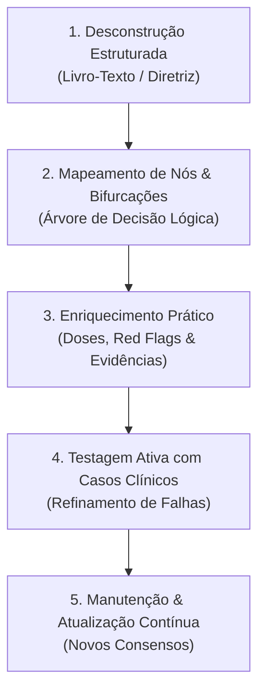

# Método de Construção de Fluxogramas Clínicos para Aprendizagem e Atendimento Médico (Framework Clínico-Visual)

> **Destinado a:** Estudantes de Medicina, Médicos Residentes e Generalistas  
> **Objetivo:** Transformar diretrizes, tratados e consensos em algoritmos de decisão clínica rápidos, memorizáveis e aplicáveis à beira do leito e no ambulatório.

---

## 1. Por que aprender por Fluxogramas Clínicos?

A prática médica no internato e na residência exige transição rápida do conhecimento teórico (declarativo) para o raciocínio clínico decisório (procedimental). 

| Aprendizado Tradicional (Texto Corrido) | Aprendizado por Fluxograma Clínico |
| :--- | :--- |
| **Passivo:** Leitura linear com sobrecarga cognitiva de detalhes secundários. | **Ativo:** Simula o processo mental de hipótese $\rightarrow$ teste $\rightarrow$ conduta. |
| **Baixa retenção de prioridades:** Dificuldade em saber o que perguntar/fazer primeiro. | **Hierárquico:** Evidencia *Red Flags*, bifurcações críticas e condutas imediatas. |
| **Lento na consulta:** Inviável consultar tratados de 1.000 páginas durante o atendimento. | **Ágil no ambulatório:** Consulta em < 15 segundos para guiar anamnese, exame e prescrição. |

---

## 2. As 5 Etapas do Método de Construção de Fluxogramas

---

### ETAPA 1: Desconstrução Estruturada da Fonte (Mineração de Dados)

Ao ler um capítulo de tratado médico (como o Tratado FEBRASGO) ou uma diretriz clínica, não resuma linearmente. Extraia os elementos através da matriz **P.A.T.O.L.O.G.I.A**:

1. **P - Porta de Entrada (Queixa Principal / Motivo da Consulta):** Como o paciente formula o motivo da consulta (ex.: *"não sinto vontade de ter relação"*, *"minha menstruação não para"*, *"quero colocar um DIU ou implante para não esquecer a pílula"*, *"palpei um caroço na mama"*, *"está saindo líquido com sangue pelo bico do peito"*).
2. **A - Anamnese Dirigida (Perguntas Filtrantes):** 
   - Caracterização temporal: Início, duração, regularidade, volume.
   - Certeza razoável de não gravidez (Critérios OMS) ou histórico reprodutivo/familiar oncológico (parentes de 1º grau com CA de mama &lt; 50 anos ou CA de ovário).
3. **T - Triagem de Fatores Extrínsecos / Iatrogenias / Comorbidades:** Uso de medicações (ex.: ISRS, anticoagulantes, terapia hormonal, indutores de CYP3A4, inibidores do CYP2D6 como fluoxetina que reduzem a eficácia do tamoxifeno), comorbidades (HAS, tabagismo, TEV prévio, enxaqueca com aura, mutações BRCA1/BRCA2).
4. **O - Objetivação no Exame Físico:** Manobras específicas, estabilidade hemodinâmica, exame pélvico/especular, toque bimanual, inspeção estática/dinâmica mamária (retração, abaulamento), palpação das mamas e das cadeias linfonodais axilares e supraclaviculares.
5. **L - Laboratório & Imagem Racional:** O que realmente muda a conduta imediata (ex.: $\beta$-hCG, Hemograma, Ferritina, USTV; Mamografia anual dos 40 aos 74 anos, USG complementar em mamas densas, RM com contraste em alto risco a partir dos 25-30 anos).
6. **O - Organização Diagnóstica & Classificação:** Definições formais e acrônimos padronizados:
   - **Sexologia:** Critérios DSM-5 e CID-11.
   - **Sangramento Uterino Anormal:** Sistema **PALM-COEIN** da FIGO.
   - **Contracepção:** **Critérios Médicos de Elegibilidade da OMS / FEBRASGO (Categorias 1 a 4)**.
   - **Mastologia:** Classificação **BI-RADS® (Categorias 0 a 6)** do ACR e Subtipos Moleculares (Luminal A, Luminal B, HER2 e Triplo-Negativo).
7. **G - Graduação Terapêutica (Escalonamento):** 
   - 1ª Linha (Padrão-ouro baseado em ensaios clínicos, sobrevida global e Índice de Pearl).
   - 2ª Linha (Alternativas orais ou sob demanda).
   - Abordagem Cirúrgica & Multidisciplinar (Cirurgia conservadora + RT obrigatória vs Mastectomia; BLS axilar; Hormonioterapia com Tamoxifeno ou Inibidores da Aromatase; Quimioterapia Neoadjuvante vs Adjuvante).
8. **I - Interações & Contraindicações:** Alertas de segurança estrita e contraindicações absolutas (Categoria 4 da OMS; contraindicações a estrogênio; interação do Tamoxifeno com inibidores fortes do CYP2D6; contraindicação a RT em gestantes ou colagenoses graves).
9. **A - Avaliação de Resposta (Follow-up):** Prazos definidos para retorno (ex.: 3 a 6 semanas pós-inserção de LARC; controle semestral de BI-RADS 3 por 3 anos; seguimento oncológico com exame clínico semestral e MMG anual).

---

### ETAPA 1.1: O Roteiro Semiológico Estruturado (Da Queixa ao Nó Decisório)

Para conectar perfeitamente a anamnese aos nós do fluxograma, cada queixa clínica do paciente deve ser rigorosamente caracterizada nos seguintes 4 eixos semiológicos:
1. **Frequência & Periodicidade:** Ritmo do sintoma (contínuo, diário, cíclico perimenstrual, pós-coital, esporádico ou paroxístico).
2. **Intensidade & Gravidade Objetiva:** Mensuração padronizada através de escalas validadas (EVA 0–10 para dor, quantificação de trocas de absorventes e presença de coágulos > 2,5 cm para sangramentos, escore ICIQ-SF para incontinência, índice de Ferriman-Gallwey para hirsutismo).
3. **Duração & Evolução:** Instalação aguda vs crônica, tempo de permanência por ciclo (ex.: sangramento > 8 dias) e persistência global em meses ou anos.
4. **Sintomas Associados & Alertas Vermelhos (*Red Flags*):** Sintomas de múltiplos compartimentos pélvicos (dispareunia, disúria, disquezia), repercussões sistêmicas (anemia ferropriva, febre, sepse, compressão de órgãos vizinhos) e bandeiras vermelhas de malignidade.

---

### ETAPA 2: Mapeamento da Arquitetura Lógica (Nós e Arestas)

Para que o fluxograma seja intuitivo, utilize uma convenção padronizada de símbolos e cores:

| Elemento | Formato / Cor | Função Clínica | Exemplo |
| :--- | :--- | :--- | :--- |
| **Nó de Entrada** | Oval / Azul Escuro | Queixa ou Ponto de Partida | `Mulher com nódulo mamário palpável` |
| **Nó de Decisão** | Losango / Amarelo | Pergunta binária (Sim/Não) ou categórica | `Lesão sólida ou cística na Ultrassonografia?` |
| **Nó de Alerta (*Red Flag*)** | Retângulo / Vermelho | Critério de exclusão / urgência / malignidade | `Nódulo espiculado BI-RADS 5: Biópsia Core Biopsy Imediata` |
| **Nó de Ação Clínica** | Retângulo / Verde Claro | Conduta propedêutica imediata | `Solicitar Mamografia Bilateral + USG complementar (> 35 anos)` |
| **Nó de Prescrição / Desfecho** | Retângulo Arredondado / Verde Escuro | Conduta terapêutica com posologia | `Hormonioterapia com Tamoxifeno 20mg/dia VO por 5 anos` |
| **Nó de Intercorrência** | Retângulo / Roxo | Manejo de efeitos adversos e complicações | `Troca de inibidor de aromatase por tamoxifeno se artralgia severa` |

---

### ETAPA 3: Exemplos Práticos de Aplicação do Framework

#### Exemplo A: Disfunção Sexual Feminina (Cap. 10-12 FEBRASGO)
- **Porta:** *"Não sinto prazer nem consigo ter orgasmo na relação com meu marido."*
- **Anamnese & Corte:** Persiste há $\ge 6$ meses gerando sofrimento. Uso de ISRS (Escitalopram 20mg).
- **Conduta:** Anorgasmia iatrogênica $\rightarrow$ Associar Bupropiona 150mg/dia VO (antídoto) + Técnica da Masturbação Dirigida (Nível 2).

#### Exemplo B: Sangramento Uterino Anormal (Cap. 45 FEBRASGO / PALM-COEIN)
- **Porta:** *"Minha menstruação está durando 15 dias com fluxo volumoso e coágulos."*
- **Red Flag:** $\beta$-hCG negativo; PA 120x80 mmHg (Estável $\rightarrow$ SUA Crônico).
- **Propedêutica:** USTV evidencia mioma submucoso tipo 1 de 2,4 cm (AUB-L_sm). Escore STEPW Lasmar = 3 (Grupo I).
- **Conduta:** Miomectomia histeroscópica em tempo único + Suplementação de Ferro.

#### Exemplo C: LARCs & Contracepção de Longa Ação (Cap. 70 e 74 FEBRASGO)
- **Porta:** *"Tenho 17 anos, sou nulípara, esqueço a pílula com frequência e não quero engravidar nem ter fluxo menstrual intenso."*
- **Triagem OMS:** Nuliparidade e adolescência = Categoria 1 (Sem restrições para LARCs). Razoável certeza de não gravidez confirmada.
- **Seleção do Método:** Deseja redução de fluxo/amenorreia e alta eficácia $\rightarrow$ **Implante de Etonogestrel 68 mg** (Pearl: 0,05) OU **SIU-LNG 19,5 mg (Kyleena)** / **SIU-LNG 52 mg (Mirena)**.
- **Orientações:** Orientação antecipatória sobre padrão de sangramento nos primeiros 3-6 meses para garantir alta adesão.

#### Exemplo D: Mastologia & Câncer de Mama (Cap. 83 a 86 FEBRASGO / SBM / CBR)
- **Porta:** *"Palpei um caroço endurecido indolor na mama esquerda há 1 mês."*
- **Avaliação Tríplice:** Paciente de 48 anos. Exame clínico: nódulo pétreo aderido de 2,2 cm em QSL esquerdo, axila clinicamente negativa (cN0). Mamografia: nódulo espiculado denso (BI-RADS 5).
- **Diagnóstico Histopatológico:** Core Biopsy revela Carcinoma Ductal Infiltrante (Grau 2). Imuno-histoquímica: RE+ (90%), RP+ (80%), HER2 negativo, Ki-67 = 8% $\rightarrow$ Subtipo **Luminal A**.
- **Conduta Multidisciplinar:** Cirurgia Conservadora (Quadrantectomia com margens livres) + Biópsia de Linfonodo Sentinela (BLS) + Radioterapia Adjuvante na mama + Hormonioterapia com Inibidor de Aromatase (se pós-menopausa) ou Tamoxifeno 20mg/dia (se pré-menopausa) por 5 a 10 anos. Quimioterapia dispensável.

#### Exemplo E: Oncologia Ginecológica - Colo Uterino (Cap. 13, 14, 77 e 79 FEBRASGO)
- **Porta:** *"Vim mostrar meu preventivo que deu lesão de alto grau (HSIL)."*
- **Propedêutica:** Paciente de 32 anos. Colposcopia evidencia epitélio acetobranco denso com pontilhado grosseiro em ZT tipo 1 totalmente ectocervical (Achado Colposcópico Maior).
- **Decisão Terapêutica:** Idade $\ge 25$ anos + ZT tipo 1 totalmente visível + Achado Maior $\rightarrow$ Elegível para estratégia *"Ver e Tratar"* com Excisão da Zona de Transformação por alça diatérmica (EZT 1 / CAF) em nível ambulatorial, ou biópsia dirigida confirmatória seguida de CAF. Margens livres e seguimento citocolposcópico semestral.

#### Exemplo F: Reprodução Humana - Infertilidade Conjugal (Cap. 48 a 52 FEBRASGO)
- **Porta:** *"Estamos tentando engravidar há 14 meses sem sucesso. Tenho 29 anos e meu marido tem 31."*
- **Triagem & Propedêutica Básica:** Casal jovem ($< 35$ anos) com mais de 12 meses de tentativas. Investigação dos 4 pilares: espermograma com normozoospermia (OMS 2021); histerossalpingografia com Prova de Cotte positiva bilateral (trompas pérvias); USTV com cavidade uterina normal; porém progesterona sérica no D22 = 1,1 ng/mL associada a oligomenorreia (ciclos de 45 a 60 dias) e ovários com aspecto policístico (CFA = 24 folículos) $\rightarrow$ Diagnóstico de **Infertilidade por Fator Ovulatório / Anovulação Crônica (SOP)**.
- **Decisão Terapêutica de Baixa Complexidade:** Indução da ovulação com **Letrozol 2,5 mg/dia** do D3 ao D7 + Monitoramento por USTV a partir do D10 + Gatilho com **hCG recombinante** quando folículo líder atingir 18-20 mm + Relações programadas nas 24-36h pós-hCG + Suporte lúteo com Progesterona micronizada vaginal. Alta probabilidade de sucesso sem necessidade de FIV primária.

#### Exemplo G: Ginecologia Endócrina - Síndrome dos Ovários Policísticos (Cap. 42 e 43 FEBRASGO / Teede 2023)
- **Porta:** *"Minha menstruação vem a cada 2 ou 3 meses, estou com muitos pelos no queixo e abdômen e ganhei 8 kg no último ano."*
- **Propedêutica & Critérios de Rotterdam:** Paciente de 24 anos, IMC 29,5 kg/m², Índice de Ferriman-Gallwey = 12 (hirsutismo clínico) associado a oligomenorreia crônica e USTV com 26 folículos antrais de 3 a 7 mm no ovário direito com volume de 12,4 cm³ (PCOM). Exclusão obrigatória de outras causas: 17-OH-progesterona = 85 ng/dL (HAC afastada), TSH e Prolactina normais.
- **Estratificação Metabólica & Terapêutica:** Diagnóstico de SOP Fenótipo A (completo). TOTG 75g evidencia glicemia de 2 horas = 152 mg/dL (intolerância à glicose) com acantose nigricante cervical. Conduta combinada: Mudança do Estilo de Vida (MEV) com meta de perda ponderal de 7-10% + Metformina 1.500 mg/dia para sensibilização insulínica + Anticoncepcional Oral Combinado antiandrogênico (Etinilestradiol 30 mcg + Drospirenona 3 mg) para regularização menstrual, proteção endometrial e controle do hirsutismo. Reavaliação dermatológica em 6 meses para avaliar necessidade de espironolactona.

#### Exemplo H: Patologia Miometrial - Adenomiose (Capítulo 34 FEBRASGO / Consenso MUSA 2022)
- **Porta:** *"Minha menstruação virou uma hemorragia cheia de coágulos, minhas cólicas pioram a cada mês e sinto meu útero pesado e dolorido."*
- **Propedêutica & Critérios MUSA:** Paciente de 42 anos, multípara (G3P2A1), com queixa de menorragia e dismenorreia secundária há 2 anos. Toque bimanual evidencia útero difusamente aumentado (correspondente a 10 semanas), globoso e doloroso. USTV revela útero de 165 cm³, espessamento miometrial assimétrico com parede posterior de 32 mm e anterior de 16 mm, múltiplos microcistos miometriais anecoicos de 2 a 4 mm, sombras acústicas em leque (*rain shower*) e vascularização translesional ao Doppler colorido, preenchendo múltiplos critérios MUSA de **Adenomiose Difusa**. RM pélvica confirma espessura da Zona Juncional de 15 mm em T2.
- **Decisão Terapêutica Escalonada:** Paciente com prole concluída desejando preservação uterina inicial. 1ª linha farmacológica: inserção de **SIU-LNG 52 mg (Mirena)** no ambulatório para atrofia endometrial profunda e alívio da dismenorreia, associando Ácido Tranexâmico 1g VO 8/8h durante os primeiros fluxos se necessário. Se persistência de sangramento incapacitante após 6 meses de SIU-LNG ou recusa: indicação de **Histerectomia Total por via minimamente invasiva (Laparoscópica/Vaginal)** com conservação ovariana.

#### Exemplo I: Ginecologia Cirúrgica & Reprodutiva - Endometriose (Capítulo 35 FEBRASGO / ESHRE 2022)
- **Porta:** *"Tenho cólicas horríveis que me fazem faltar ao trabalho, sinto muita dor profunda nas relações sexuais e uma pontada forte no reto para evacuar quando estou menstruada."*
- **Propedêutica & Mapeamento Especializado:** Paciente de 29 anos, nuligesta, com os 6 "D"s clássicos (dismenorreia severa, dispareunia de profundidade, dor pélvica crônica e disquezia cíclica). Toque vaginal bimanual e retovaginal revela espessamento doloroso com nodularidade fibrótica em ligamento uterossacro esquerdo e fundo de saco de Douglas bloqueado. USTV com preparo intestinal confirma **Endometriose Profunda Infiltrativa**: nódulo de 2,1 cm em ligamento uterossacro esquerdo e nódulo de 1,8 cm infiltrando a camada muscular própria da parede anterior do retossigmoide sem estenose suboclusiva, além de endometrioma ovariano esquerdo de 3,2 cm com padrão típico em "vidro fosco".
- **Decisão Terapêutica Individualizada:** Como a paciente não deseja engravidar imediatamente e não há sinais de suboclusão intestinal ou hidronefrose ureteral, a conduta de 1ª linha é o **tratamento clínico com Dienogeste 2 mg/dia VO contínuo** para supressão da dor, associado a acompanhamento por equipe multidisciplinar (ginecologia, coloproctologia, nutrição e fisioterapia pélvica). Se falha ou intolerância após 6 meses: indicação de cirurgia laparoscópica conservadora (*shaving* ou ressecção em disco do nódulo intestinal e cistectomia delicada do endometrioma com preservação estromal). Se no futuro optar por engravidar: suspender dienogeste e considerar FIV direta pelo acometimento profundo e ovariano.

#### Exemplo J: Uroginecologia - Prolapso de Órgãos Pélvicos (POP) & Incontinência Oculta (Capítulo 68 FEBRASGO / IUGA-ICS)
- **Porta:** *"Sinto um peso horrível lá embaixo, como se tivesse uma bola saindo pela minha vagina quando fico em pé ou caminho, e tenho que empurrar para conseguir urinar direito."*
- **Propedêutica & Estadiamento POP-Q:** Paciente de 64 anos, multípara (4 partos vaginais domiciliares). Exame ginecológico com esforço (Valsalva máxima) revela grande prolapso da parede vaginal anterior com ponto Ba em +4 cm e colo uterino com ponto C em +2 cm, com comprimento vaginal total (tvl) de 8 cm $\rightarrow$ Diagnóstico de **Prolapso de Parede Anterior (Cistocele) e Prolapso Apical Uterino Estádio III**. Nega perda de urina espontânea no dia a dia.
- **Investigação da IUE Oculta (Mascarada) & Conduta Cirúrgica:** Ao realizar o **Teste de Redução do Prolapso** com espéculo descolado, desfazendo o dobramento mecânico (*kinking*) da uretra, a paciente apresenta perda involuntária de urina em jato franco aos esforços de tosse $\rightarrow$ **Incontinência Urinária de Esforço Oculta Positiva**. Decisão cirúrgica reconstrutiva compartilhada: Paciente com vida sexual ativa desejando preservação do canal vaginal $\rightarrow$ Indicação de **Sacrocolpopexia Abdominal Laparoscópica (promontofixação com tela em Y)** associada a **Colporrafia Anterior e Sling Suburetral Sintomático Simultâneo**, corrigindo o defeito apical de nível 1, a cistocele de nível 2 e prevenindo a incontinência urinária grave no pós-operatório.

#### Exemplo K: Uroginecologia - Incontinência Urinária Feminina & Estudo Urodinâmico (Capítulos 63 a 65 FEBRASGO / ICS-IUGA)
- **Porta:** *"Não posso rir, espirrar ou carregar as compras que perco xixi na roupa, e às vezes dá uma vontade tão desesperadora do nada que não dá tempo de chegar ao banheiro."*
- **Propedêutica & Diagnóstico de Incontinência Mista (IUM):** Paciente de 52 anos, multípara (G3P2), refere queixa mista de perda ao esforço e urgência imperiosa. Urina 1 e urocultura negativas (afastando ITU). Diário miccional de 3 dias revela 10 micções diurnas, 3 noctúrias e 4 episódios diários de escape sincrônico à tosse. Exame físico evidencia atrofia genital leve e teste do cotonete com hipermobilidade uretral de 45°. O estudo urodinâmico (EUD) demonstra: urofluxometria livre normal (Qmax 22 mL/s, resíduo 15 mL); cistometria com contrações não inibidas do detrusor aos 180 mL confirmando **Hiperatividade Detrusora**; e manobra de esforço com perda em jato a uma Pressão de Perda sob Esforço (**VLPP = 110 cmH2O**), confirmando **Hipermobilidade Uretral pura com esfíncter competente**.
- **Decisão Terapêutica Sequencial Integrada:** Conforme a regra de ouro da FEBRASGO, como os escapes diários de esforço são a principal queixa incapacitante relatada pela paciente, a conduta inicial envolve **Fisioterapia Pélvica Supervisionada (TMAP) associada a medidas comportamentais por 3 meses**. Diante de melhora parcial da urgência, mas persistência de perda importante aos esforços, é indicada a colocação de **Sling Transobturador (TOT)** para correção anatômica da hipermobilidade uretral, mantendo orientações comportamentais e associando **Mirabegrona 50 mg/dia** caso a urgência residual persista no pós-operatório, com excelente resolução e segurança.

#### Exemplo L: Endocrinologia Ginecológica - Climatério & Terapia Hormonal da Menopausa (Capítulos 56 a 60 FEBRASGO / NAMS 2023)
- **Porta:** *"Tenho 52 anos, parei de menstruar há 1 ano e não consigo mais dormir nem trabalhar direito de tantas ondas de calor e suor que me sobem ao peito e rosto o dia todo, além de sentir muita dor para ter relações sexuais pelo ressecamento."*
- **Propedêutica & Janela de Oportunidade:** Paciente de 52 anos, amenorreia há 14 meses (diagnóstico retrospectivo de menopausa / estádio +1a do STRAW+10). Encontra-se plenamente **dentro da janela de oportunidade** (idade < 60 anos e menopausa < 10 anos). Mamografia BI-RADS 1 há 4 meses, ultrassom transvaginal com eco endometrial linear de 2,5 mm, exames metabólicos: PA 135/85 mmHg (hipertensão leve controlada), triglicerídeos de 210 mg/dL, glicemia normal. Nega histórico pessoal ou familiar de trombose ou neoplasia de mama/endométrio (checklist de contraindicações zerado).
- **Decisão Terapêutica Personalizada:** Como a paciente tem **útero preservado**, é mandatório prescrever **Estrogênio associado a Progestagênio** para proteção endometrial. Por apresentar hipertensão e hipertrigliceridemia (> 200 mg/dL), a via oral é desaconselhada pelo impacto no metabolismo hepático de primeira passagem. Prescreve-se: **17-beta-estradiol em gel 0,75 mg (1 pump) ao dia por via transdérmica** associado a **Progesterona Micronizada Natural 100 mg/dia VO contínua à noite** (regime contínuo combinado). Para a atrofia vulvovaginal severa com dispareunia, associa-se **Estriol creme vaginal 1 mg/g 2 vezes por semana**. Em 3 meses, a paciente relata remissão total dos fogachos, melhora do padrão do sono e vida sexual confortável sem dor, usufruindo da proteção óssea e cardiovascular da THM.

#### Exemplo M: Endocrinologia Ginecológica Avançada - Terapia de Reposição Hormonal Especializada & Testosterona no TDSH (Capítulos 47 e 57 FEBRASGO / Global Position Statement on Testosterone 2019/2024)
- **Porta:** *"Faço reposição hormonal certinha com estradiol e progesterona, meus calores sumiram, mas perdi completamente o interesse sexual, não sinto mais prazer, e isso está me causando um sofrimento imenso no meu casamento."*
- **Propedêutica & Critérios Diagnósticos de TDSH:** Paciente de 54 anos em THM fisiológica otimizada (estradiol transdérmico 1 mg + progesterona micronizada 100 mg contínua) há 1 ano com controle vasomotor completo. Queixa de perda marcada de libido e responsividade sexual acompanhada de acentuado sofrimento pessoal (*distress*), persistente há mais de 6 meses $\rightarrow$ preenche critérios de **Transtorno do Desejo Sexual Hipoativo (TDSH)**. Excluem-se depressão maior, conflitos conjugais severos, disfunções iatrogênicas por drogas serotoninérgicas e dispareunia anatômica.
- **Avaliação Laboratorial de Segurança & Prescrição Baseada em Evidências:** Dosagem basal de Testosterona Total e SHBG (não para diagnosticar hipoandrogenismo, mas para estabelecer linha de base e afastar níveis já elevados). Prescreve-se **Testosterona transdérmica em gel a 1% (~5 mg/dia aplicados em pele limpa e seca, liberando dose fisiológica feminina de ~300 mcg/dia)**. Rejeição e advertência expressa contra "chips da beleza" / implantes subcutâneos manipulados e formulações masculinas injetáveis.
- **Monitoramento e Reavaliação:** Controle de testosterona total entre 3 a 6 semanas para assegurar que não ultrapasse a faixa suprafisiológica feminina. Reavaliação clínica do TDSH em 3 e 6 meses; caso não haja benefício clínico demonstrado após 6 meses de uso contínuo, a terapia androgênica é descontinuada.

#### Exemplo N: Patologia Infecciosa Ginecológica - Doença Inflamatória Pélvica & Manejo de Cervicite com Risco de Abscesso Tubo-Ovariano (Capítulos 26 a 28 FEBRASGO / CDC 2021/2024)
- **Porta:** *"Doutor, comecei com um corrimento amarelado fétido há 10 dias após uma nova relação sexual, e há 3 dias estou com uma dor insuportável no pé da barriga que piora ao andar, tive calafrios e febre de 38,5°C ontem à noite."*
- **Propedêutica & Critérios Diagnósticos de DIP:** Paciente de 23 anos, nulípara, usuária de preservativo irregular. Ao exame: abdome doloroso à palpação profunda em hipogástrio e fossas ilíacas com descompressão dolorosa positiva localizada na pelve (sinal de peritonite pélvica). Exame especular: colo hiperemiado com saída abundante de secreção mucopurulenta pelo orifício cervical externo e friabilidade ao toque do swab (cervicite aguda). Toque bimanual: dor lancinante à mobilização do colo uterino e empastamento/dor anexial bilateral sem massas palpáveis bem delimitadas $\rightarrow$ Preenche os **3 Critérios Maiores (Obrigatórios)** de dor pélvica + dor anexial + dor à mobilização cervical **mais 2 Critérios Menores (Adicionais)** de febre $> 38,3^\circ\text{C}$ e secreção mucopurulenta endocervical. Beta-hCG urinário negativo (excluindo gestação ectópica).
- **Estadiamento de Monif & Decisão de Internação:** Presença de peritonite pélvica associada à febre alta e taquicardia define **DIP Estádio II de Monif**. Por apresentar peritonite pélvica, o tratamento ambulatorial oral é contraindicado, sendo mandatória a **Internação Hospitalar Imediata** para antibioticoterapia endovenosa e monitoramento rigoroso.
- **Conduta Hospitalar & Seguimento:** Solicitação imediata de hemograma (leucocitose de 16.200 com desvio), PCR (85 mg/L), urina I, testes moleculares (NAAT/PCR cervical) para *Chlamydia trachomatis* e *Neisseria gonorrhoeae*, além de Ultrassonografia Transvaginal (que afasta abscesso tubo-ovariano, evidenciando espessamento tubário bilateral compatível com salpingite aguda). Início imediato do esquema parenteral de 1ª linha: **Ceftriaxona 1 g IV 1x/dia + Doxiciclina 100 mg VO 12/12h + Metronidazol 500 mg IV 8/8h**. Notificação compulsória de IST, convocação do parceiro para tratamento empírico de gonococo e clamídia, e manutenção da antibioticoterapia hospitalar até 24 a 48h de apirexia e melhora clínica franca, completando 14 dias de esquema oral na alta.

#### Exemplo O: Emergência Ginecológica - Doença Inflamatória Pélvica Estádio III (Abscesso Tubo-Ovariano Íntegro) & Manejo Hospitalar Conservador vs Intervencionista (Capítulo 28 FEBRASGO / CDC 2021/2024)
- **Porta:** *"Tenho 29 anos, uso DIU de cobre há 1 ano e estou com uma dor profunda no lado direito da barriga há 1 semana que foi piorando com febre de 39°C, calafrios e sinto um inchaço doloroso por dentro que não me deixa nem sentar."*
- **Propedêutica & Critérios Diagnósticos de Gainesville:** Paciente afebril no momento por antitérmico, desidratada, fácies de sofrimento agudo, PA 105/65 mmHg, FC 112 bpm. Abdome: dor intensa à palpação profunda em fossa ilíaca direita e hipogástrio, com defesa muscular voluntária e descompressão dolorosa positiva em quadrantes inferiores. Ao toque bimanual: dor extrema à mobilização do colo uterino e palpação de massa inflamatória anexial direita de consistência pastosa, dolorosa e mal delimitada, medindo cerca de 6 a 7 cm. Fios do DIU visíveis no colo com saída de secreção purulenta endocervical. Beta-hCG negativo.
- **Investigação por Imagem & Estadiamento de Monif:** Ultrassonografia Transvaginal urgente revela espessamento tubário e imagem cística complexa multilobulada com ecos internos espessos e debris no anexo direito, medindo 6,2 x 5,5 cm, compatível com **Abscesso Tubo-Ovariano (ATO) íntegro**. Esse achado fecha o diagnóstico de **DIP Estádio III de Monif**.
- **Decisão Terapêutica Hospitalar e Conduta com o DIU:** Internação imediata em enfermaria de alta vigilância cirúrgica. Conduta do DIU: **NÃO remover o DIU de imediato**, pois a manipulação intrauterina na fase aguda pode disseminar a bacteremia; a remoção só é indicada se não houver resposta após 48 a 72 horas de antibióticos. Inicia-se **Ceftriaxona 2 g IV 1x/dia + Doxiciclina 100 mg VO 12/12h + Metronidazol 500 mg IV 8/8h**. Como o ATO mede 6,2 cm (< 8 a 10 cm) e a paciente está hemodinamicamente estável, adota-se a conduta conservadora clínica inicial (sucesso esperado de 70 a 80%).
- **Evolução & Seguimento das Sequelas:** Após 48 horas de terapia venosa, a paciente apresenta apirexia sustentada, queda da leucocitose de 18.500 para 11.200 e regressão da dor. Mantém-se o DIU (não precisou ser retirado) e a terapia IV por 5 dias até apirexia total por 48h, recebendo alta com Doxiciclina + Metronidazol VO para completar 14 dias. Aconselhamento sobre risco futuro de gravidez ectópica e programação de Histerossalpingografia (HSG) em 3 meses para avaliar sequelas de permeabilidade tuboperitoneal.

#### Exemplo P: Endocrinologia Ginecológica & Cirurgia - Miomatose Uterina Sintomática FIGO 1 e 2 em Mulher Jovem com Anemia Ferropriva e Desejo de Preservação Uterina (Capítulo 32 FEBRASGO / ESGE)
- **Porta:** *"Tenho 32 anos, não tenho filhos ainda e sonho em engravidar, mas minhas menstruações estão durando 10 dias com coágulos enormes, estou muito fraca e desmaiando de anemia, e meu médico disse que terei que retirar meu útero por causa de miomas."*
- **Propedêutica & Mapeamento Topográfico:** Paciente com palidez cutânea 3+/4+, hemoglobina de 7,8 g/dL e ferritina de 6 ng/mL (anemia ferropriva severa por SUA-L). Ultrassonografia Transvaginal e Histerossonografia revelam útero aumentado (volume 190 cm³) com nódulo submucoso em parede posterior de 3,2 cm com penetração miometrial de 40% (FIGO Tipo 1) e manto miometrial livre residual de 7 mm. Histeroscopia diagnóstica confirma nódulo submucoso único com base séssil correspondente a um **Escore de Lasmar de 5 pontos** (Grupo I: baixa complexidade, favorável à ressecção endocavitária em tempo único).
- **Decisão Terapêutica Escalonada & Preservação da Fertilidade:** O diagnóstico refuta categoricamente a histerectomia mutiladora proposta inicialmente! A conduta padrão-ouro envolve: 1) Correção rápida da anemia com **Carboximaltose Férrica 1.000 mg IV**; 2) Controle transitório do sangramento e preparo endometrial pré-operatório com **Análogo Agonista do GnRH (Goserelina 3,6 mg SC)** 4 a 6 semanas antes do procedimento; 3) **Miomectomia Histeroscópica Bipolar em Tempo Único**, realizando o fatiamento progressivo do mioma submucoso com preservação integral do miométrio adjacente e da cavidade endometrial.
- **Seguimento & Liberação para Gestação:** Paciente evolui com alta no mesmo dia do procedimento, remissão total da hipermenorreia e recuperação da hemoglobina para 12,8 g/dL em 60 dias. Histeroscopia de controle aos 2 meses demonstra cavidade uterina ampla, simétrica e sem sinéquias. A paciente é liberada para engravidar espontaneamente com preservação total de sua capacidade reprodutiva.

#### Exemplo Q: Endocrinologia Ginecológica - Amenorreia Primária com Caracteres Sexuais Femininos Normais e Agenesia Uterovaginal: Diferenciação entre Rokitansky (MRKH) e Insensibilidade Completa aos Androgênios (Morris) (Capítulo 41 FEBRASGO / ASRM)
- **Porta:** *"Tenho 16 anos, meu corpo se desenvolveu como o de todas as minhas amigas, meus seios cresceram normalmente aos 12 anos, mas até hoje nunca menstruei nem um pingo de sangue e tentei ter relação com meu namorado e não consegui porque não entrava."*
- **Propedêutica & Exame Físico por Quadrantes:** Adolescente feminina com estatura normal (1,64 m) e mamas bem desenvolvidas e simétricas (Estadiamento de Tanner M4). Inspeção de pilificação sexual evidencia pelos pubianos e axilares abundantes e normais (Tanner P4). Ao exame ginecológico: genitália externa feminina fenotipicamente normal, com hímen pérvio, mas canal vaginal curto com fundo de saco cego de cerca de 2,5 cm de profundidade, sem visualização ou palpação de colo uterino. Ultrassonografia pélvica abdominal e Ressonância Magnética de Pelve confirmam **ausência completa de útero e dos 2/3 superiores da vagina**, porém com **ovários tópicos de volume e ecotextura normais contendo folículos antrais**.
- **Diferenciação Laboratorial e Genética Estruturada:** O achado de amenorreia primária com mamas presentes e ausência de útero (Quadrante 2) impõe a diferenciação imediata entre:
  1. *Síndrome de Mayer-Rokitansky-Küster-Hauser (MRKH):* Cariótipo 46,XX + Testosterona sérica em nível feminino (< 50 ng/dL) + Pilificação sexual normal (P4-P5) + Ovários funcionantes.
  2. *Síndrome de Insensibilidade Completa aos Androgênios (Morris / CAIS):* Cariótipo 46,XY + Testosterona sérica em nível masculino (> 250-400 ng/dL) + Pilificação ausente/escassa (P1-P2) + Testículos intra-abdominais criptorquídicos.
  O laboratório revela **Testosterona Total de 28 ng/dL** (faixa feminina normal) e **Cariótipo com Banda G: 46,XX**, confirmando o diagnóstico de **Síndrome de Rokitansky (MRKH)**.
- **Rastreio de Malformações Extragenitais & Conduta Terapêutica:** A embriogênese comum dos ductos mesonéfricos e paramesonéfricos exige rastreio obrigatório: USG de Vias Urinárias revela rim único à direita com agenesia renal unilateral à esquerda (presente em 35% dos casos de MRKH); radiografia de coluna não revela anomalias vertebrais. Conduta clínica de 1ª linha para o canal vaginal: **Terapia de Dilatação Progressiva de Frank / Vecchietti**, sem necessidade inicial de cirurgia de neovagina (McIndoe).
- **Acolhimento Psicológico & Aconselhamento Reprodutivo:** Suporte psicoterapêutico especializado para adaptação da imagem corporal e vivência da sexualidade. Esclarecimento à família e à jovem de que seus ovários são biologicamente perfeitos e produzem óvulos normais; caso deseje ter filhos no futuro, há possibilidade de gestação biológica com óvulos próprios via Fertilização in Vitro (FIV) e **Útero de Substituição ("Barriga Solidária")** em conformidade com as resoluções do CFM.

---

### ETAPA 4: Validação por Casos Clínicos (Técnica do "Stress Test")

Antes de dar um fluxograma por concluído, execute o **Teste dos 3 Casos Clínicos Reais/Simulados**:

1. **Caso Típico / Livro-texto:** Ex.: Paciente jovem buscando método reversível de alta eficácia sem esquecimentos $\rightarrow$ Implante de Etonogestrel ou SIU-LNG.
2. **Caso com Fator Confundidor / Comorbidade:** Ex.: Paciente com histórico de TVP prévio ou enxaqueca com aura buscando contracepção $\rightarrow$ Contraindicação a estrogênio (Cat 4), mas elegível para todos os LARCs (DIU-Cu, SIU-LNG e Implante = Cat 1/2).
3. **Caso de Intercorrência Ambulatorial:** Ex.: Usuária de Implante de Etonogestrel com *spotting* persistente em borra de café há 4 meses querendo remover o dispositivo $\rightarrow$ Protocolo FMRP-USP/FEBRASGO de manejo medicamentoso antes de retirar.

---

### ETAPA 5: Checklist para Criação de Novos Fluxogramas

Copie e preencha este checklist sempre que for estudar um novo tema médico:

- [ ] **1. Queixa Principal:** O fluxograma começa pela queixa ou desejo da paciente?
- [ ] **2. Red Flags & Gravidade:** Foram excluídas causas agudas/urgentes e gravidez logo no início?
- [ ] **3. Tempo de Evolução & Elegibilidade:** Os critérios temporais e categorias de elegibilidade (OMS 1-4) foram pontuados?
- [ ] **4. Exame Físico Dirigido:** As manobras e achados essenciais foram pontuados?
- [ ] **5. Laboratório Racional:** Os exames complementares têm indicação clara e justificável?
- [ ] **6. Escalonamento Terapêutico:** O tratamento tem 1ª, 2ª e 3ª linhas bem demarcadas?
- [ ] **7. Prescrições Práticas:** As doses, vias, esquemas de desmame e contraindicações estão descritas?
- [ ] **8. Falha Terapêutica / Efeitos Adversos:** O fluxograma orienta o que fazer diante de complicações ou efeitos colaterais comuns?
- [ ] **9. Níveis de Evidência:** As opções estão categorizadas segundo diretrizes de referência (FEBRASGO / OMS)?
- [ ] **10. Validação:** O fluxo foi testado com pelo menos 3 casos clínicos diferentes?

---

*Documento base de diretrizes para o Portal Clínico `index.html`.*
