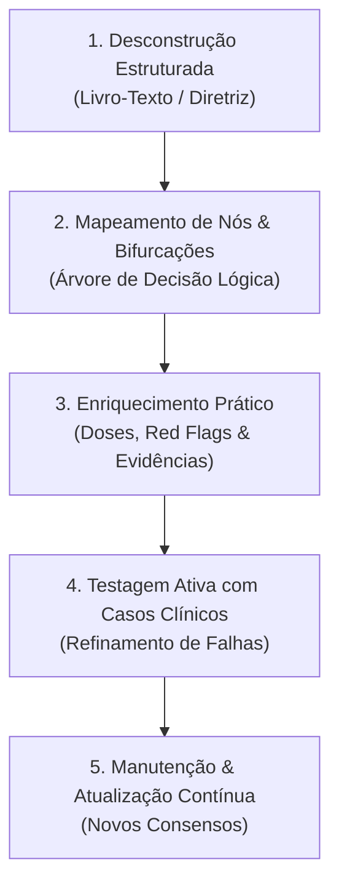

# Método de Construção de Fluxogramas Clínicos para Aprendizagem e Atendimento Médico (Framework Clínico-Visual)

> **Destinado a:** Estudantes de Medicina, Médicos Residentes e Generalistas  
> **Objetivo:** Transformar diretrizes, tratados e consensos em algoritmos de decisão clínica rápidos, memorizáveis e aplicáveis à beira do leito e no ambulatório.

---

## 1. Por que aprender por Fluxogramas Clínicos?

A prática médica no internato e na residência exige transição rápida do conhecimento teórico (declarativo) para o raciocínio clínico decisório (procedimental). 

| Aprendizado Tradicional (Texto Corrido) | Aprendizado por Fluxograma Clínico |
| :--- | :--- |
| **Passivo:** Leitura linear com sobrecarga cognitiva de detalhes secundários. | **Ativo:** Simula o processo mental de hipótese $\rightarrow$ teste $\rightarrow$ conduta. |
| **Baixa retenção de prioridades:** Dificuldade em saber o que perguntar/fazer primeiro. | **Hierárquico:** Evidencia *Red Flags*, bifurcações críticas e condutas imediatas. |
| **Lento na consulta:** Inviável consultar tratados de 1.000 páginas durante o atendimento. | **Ágil no ambulatório:** Consulta em < 15 segundos para guiar anamnese, exame e prescrição. |

---

## 2. As 5 Etapas do Método de Construção de Fluxogramas

---

### ETAPA 1: Desconstrução Estruturada da Fonte (Mineração de Dados)

Ao ler um capítulo de tratado médico (como o Tratado FEBRASGO) ou uma diretriz clínica, não resuma linearmente. Extraia os elementos através da matriz **P.A.T.O.L.O.G.I.A**:

1. **P - Porta de Entrada (Queixa Principal / Motivo da Consulta):** Como o paciente formula o motivo da consulta (ex.: *"não sinto vontade de ter relação"*, *"minha menstruação não para"*, *"quero colocar um DIU ou implante para não esquecer a pílula"*, *"palpei um caroço na mama"*, *"está saindo líquido com sangue pelo bico do peito"*).
2. **A - Anamnese Dirigida (Perguntas Filtrantes):** 
   - Caracterização temporal: Início, duração, regularidade, volume.
   - Certeza razoável de não gravidez (Critérios OMS) ou histórico reprodutivo/familiar oncológico (parentes de 1º grau com CA de mama &lt; 50 anos ou CA de ovário).
3. **T - Triagem de Fatores Extrínsecos / Iatrogenias / Comorbidades:** Uso de medicações (ex.: ISRS, anticoagulantes, terapia hormonal, indutores de CYP3A4, inibidores do CYP2D6 como fluoxetina que reduzem a eficácia do tamoxifeno), comorbidades (HAS, tabagismo, TEV prévio, enxaqueca com aura, mutações BRCA1/BRCA2).
4. **O - Objetivação no Exame Físico:** Manobras específicas, estabilidade hemodinâmica, exame pélvico/especular, toque bimanual, inspeção estática/dinâmica mamária (retração, abaulamento), palpação das mamas e das cadeias linfonodais axilares e supraclaviculares.
5. **L - Laboratório & Imagem Racional:** O que realmente muda a conduta imediata (ex.: $\beta$-hCG, Hemograma, Ferritina, USTV; Mamografia anual dos 40 aos 74 anos, USG complementar em mamas densas, RM com contraste em alto risco a partir dos 25-30 anos).
6. **O - Organização Diagnóstica & Classificação:** Definições formais e acrônimos padronizados:
   - **Sexologia:** Critérios DSM-5 e CID-11.
   - **Sangramento Uterino Anormal:** Sistema **PALM-COEIN** da FIGO.
   - **Contracepção:** **Critérios Médicos de Elegibilidade da OMS / FEBRASGO (Categorias 1 a 4)**.
   - **Mastologia:** Classificação **BI-RADS® (Categorias 0 a 6)** do ACR e Subtipos Moleculares (Luminal A, Luminal B, HER2 e Triplo-Negativo).
7. **G - Graduação Terapêutica (Escalonamento):** 
   - 1ª Linha (Padrão-ouro baseado em ensaios clínicos, sobrevida global e Índice de Pearl).
   - 2ª Linha (Alternativas orais ou sob demanda).
   - Abordagem Cirúrgica & Multidisciplinar (Cirurgia conservadora + RT obrigatória vs Mastectomia; BLS axilar; Hormonioterapia com Tamoxifeno ou Inibidores da Aromatase; Quimioterapia Neoadjuvante vs Adjuvante).
8. **I - Interações & Contraindicações:** Alertas de segurança estrita e contraindicações absolutas (Categoria 4 da OMS; contraindicações a estrogênio; interação do Tamoxifeno com inibidores fortes do CYP2D6; contraindicação a RT em gestantes ou colagenoses graves).
9. **A - Avaliação de Resposta (Follow-up):** Prazos definidos para retorno (ex.: 3 a 6 semanas pós-inserção de LARC; controle semestral de BI-RADS 3 por 3 anos; seguimento oncológico com exame clínico semestral e MMG anual).

---

### ETAPA 2: Mapeamento da Arquitetura Lógica (Nós e Arestas)

Para que o fluxograma seja intuitivo, utilize uma convenção padronizada de símbolos e cores:

| Elemento | Formato / Cor | Função Clínica | Exemplo |
| :--- | :--- | :--- | :--- |
| **Nó de Entrada** | Oval / Azul Escuro | Queixa ou Ponto de Partida | `Mulher com nódulo mamário palpável` |
| **Nó de Decisão** | Losango / Amarelo | Pergunta binária (Sim/Não) ou categórica | `Lesão sólida ou cística na Ultrassonografia?` |
| **Nó de Alerta (*Red Flag*)** | Retângulo / Vermelho | Critério de exclusão / urgência / malignidade | `Nódulo espiculado BI-RADS 5: Biópsia Core Biopsy Imediata` |
| **Nó de Ação Clínica** | Retângulo / Verde Claro | Conduta propedêutica imediata | `Solicitar Mamografia Bilateral + USG complementar (> 35 anos)` |
| **Nó de Prescrição / Desfecho** | Retângulo Arredondado / Verde Escuro | Conduta terapêutica com posologia | `Hormonioterapia com Tamoxifeno 20mg/dia VO por 5 anos` |
| **Nó de Intercorrência** | Retângulo / Roxo | Manejo de efeitos adversos e complicações | `Troca de inibidor de aromatase por tamoxifeno se artralgia severa` |

---

### ETAPA 3: Exemplos Práticos de Aplicação do Framework

#### Exemplo A: Disfunção Sexual Feminina (Cap. 10-12 FEBRASGO)
- **Porta:** *"Não sinto prazer nem consigo ter orgasmo na relação com meu marido."*
- **Anamnese & Corte:** Persiste há $\ge 6$ meses gerando sofrimento. Uso de ISRS (Escitalopram 20mg).
- **Conduta:** Anorgasmia iatrogênica $\rightarrow$ Associar Bupropiona 150mg/dia VO (antídoto) + Técnica da Masturbação Dirigida (Nível 2).

#### Exemplo B: Sangramento Uterino Anormal (Cap. 45 FEBRASGO / PALM-COEIN)
- **Porta:** *"Minha menstruação está durando 15 dias com fluxo volumoso e coágulos."*
- **Red Flag:** $\beta$-hCG negativo; PA 120x80 mmHg (Estável $\rightarrow$ SUA Crônico).
- **Propedêutica:** USTV evidencia mioma submucoso tipo 1 de 2,4 cm (AUB-L_sm). Escore STEPW Lasmar = 3 (Grupo I).
- **Conduta:** Miomectomia histeroscópica em tempo único + Suplementação de Ferro.

#### Exemplo C: LARCs & Contracepção de Longa Ação (Cap. 70 e 74 FEBRASGO)
- **Porta:** *"Tenho 17 anos, sou nulípara, esqueço a pílula com frequência e não quero engravidar nem ter fluxo menstrual intenso."*
- **Triagem OMS:** Nuliparidade e adolescência = Categoria 1 (Sem restrições para LARCs). Razoável certeza de não gravidez confirmada.
- **Seleção do Método:** Deseja redução de fluxo/amenorreia e alta eficácia $\rightarrow$ **Implante de Etonogestrel 68 mg** (Pearl: 0,05) OU **SIU-LNG 19,5 mg (Kyleena)** / **SIU-LNG 52 mg (Mirena)**.
- **Orientações:** Orientação antecipatória sobre padrão de sangramento nos primeiros 3-6 meses para garantir alta adesão.

#### Exemplo D: Mastologia & Câncer de Mama (Cap. 83 a 86 FEBRASGO / SBM / CBR)
- **Porta:** *"Palpei um caroço endurecido indolor na mama esquerda há 1 mês."*
- **Avaliação Tríplice:** Paciente de 48 anos. Exame clínico: nódulo pétreo aderido de 2,2 cm em QSL esquerdo, axila clinicamente negativa (cN0). Mamografia: nódulo espiculado denso (BI-RADS 5).
- **Diagnóstico Histopatológico:** Core Biopsy revela Carcinoma Ductal Infiltrante (Grau 2). Imuno-histoquímica: RE+ (90%), RP+ (80%), HER2 negativo, Ki-67 = 8% $\rightarrow$ Subtipo **Luminal A**.
- **Conduta Multidisciplinar:** Cirurgia Conservadora (Quadrantectomia com margens livres) + Biópsia de Linfonodo Sentinela (BLS) + Radioterapia Adjuvante na mama + Hormonioterapia com Inibidor de Aromatase (se pós-menopausa) ou Tamoxifeno 20mg/dia (se pré-menopausa) por 5 a 10 anos. Quimioterapia dispensável.

#### Exemplo E: Oncologia Ginecológica - Colo Uterino (Cap. 13, 14, 77 e 79 FEBRASGO)
- **Porta:** *"Vim mostrar meu preventivo que deu lesão de alto grau (HSIL)."*
- **Propedêutica:** Paciente de 32 anos. Colposcopia evidencia epitélio acetobranco denso com pontilhado grosseiro em ZT tipo 1 totalmente ectocervical (Achado Colposcópico Maior).
- **Decisão Terapêutica:** Idade $\ge 25$ anos + ZT tipo 1 totalmente visível + Achado Maior $\rightarrow$ Elegível para estratégia *"Ver e Tratar"* com Excisão da Zona de Transformação por alça diatérmica (EZT 1 / CAF) em nível ambulatorial, ou biópsia dirigida confirmatória seguida de CAF. Margens livres e seguimento citocolposcópico semestral.

#### Exemplo F: Reprodução Humana - Infertilidade Conjugal (Cap. 48 a 52 FEBRASGO)
- **Porta:** *"Estamos tentando engravidar há 14 meses sem sucesso. Tenho 29 anos e meu marido tem 31."*
- **Triagem & Propedêutica Básica:** Casal jovem ($< 35$ anos) com mais de 12 meses de tentativas. Investigação dos 4 pilares: espermograma com normozoospermia (OMS 2021); histerossalpingografia com Prova de Cotte positiva bilateral (trompas pérvias); USTV com cavidade uterina normal; porém progesterona sérica no D22 = 1,1 ng/mL associada a oligomenorreia (ciclos de 45 a 60 dias) e ovários com aspecto policístico (CFA = 24 folículos) $\rightarrow$ Diagnóstico de **Infertilidade por Fator Ovulatório / Anovulação Crônica (SOP)**.
- **Decisão Terapêutica de Baixa Complexidade:** Indução da ovulação com **Letrozol 2,5 mg/dia** do D3 ao D7 + Monitoramento por USTV a partir do D10 + Gatilho com **hCG recombinante** quando folículo líder atingir 18-20 mm + Relações programadas nas 24-36h pós-hCG + Suporte lúteo com Progesterona micronizada vaginal. Alta probabilidade de sucesso sem necessidade de FIV primária.

#### Exemplo G: Ginecologia Endócrina - Síndrome dos Ovários Policísticos (Cap. 42 e 43 FEBRASGO / Teede 2023)
- **Porta:** *"Minha menstruação vem a cada 2 ou 3 meses, estou com muitos pelos no queixo e abdômen e ganhei 8 kg no último ano."*
- **Propedêutica & Critérios de Rotterdam:** Paciente de 24 anos, IMC 29,5 kg/m², Índice de Ferriman-Gallwey = 12 (hirsutismo clínico) associado a oligomenorreia crônica e USTV com 26 folículos antrais de 3 a 7 mm no ovário direito com volume de 12,4 cm³ (PCOM). Exclusão obrigatória de outras causas: 17-OH-progesterona = 85 ng/dL (HAC afastada), TSH e Prolactina normais.
- **Estratificação Metabólica & Terapêutica:** Diagnóstico de SOP Fenótipo A (completo). TOTG 75g evidencia glicemia de 2 horas = 152 mg/dL (intolerância à glicose) com acantose nigricante cervical. Conduta combinada: Mudança do Estilo de Vida (MEV) com meta de perda ponderal de 7-10% + Metformina 1.500 mg/dia para sensibilização insulínica + Anticoncepcional Oral Combinado antiandrogênico (Etinilestradiol 30 mcg + Drospirenona 3 mg) para regularização menstrual, proteção endometrial e controle do hirsutismo. Reavaliação dermatológica em 6 meses para avaliar necessidade de espironolactona.

#### Exemplo H: Patologia Miometrial - Adenomiose (Capítulo 34 FEBRASGO / Consenso MUSA 2022)
- **Porta:** *"Minha menstruação virou uma hemorragia cheia de coágulos, minhas cólicas pioram a cada mês e sinto meu útero pesado e dolorido."*
- **Propedêutica & Critérios MUSA:** Paciente de 42 anos, multípara (G3P2A1), com queixa de menorragia e dismenorreia secundária há 2 anos. Toque bimanual evidencia útero difusamente aumentado (correspondente a 10 semanas), globoso e doloroso. USTV revela útero de 165 cm³, espessamento miometrial assimétrico com parede posterior de 32 mm e anterior de 16 mm, múltiplos microcistos miometriais anecoicos de 2 a 4 mm, sombras acústicas em leque (*rain shower*) e vascularização translesional ao Doppler colorido, preenchendo múltiplos critérios MUSA de **Adenomiose Difusa**. RM pélvica confirma espessura da Zona Juncional de 15 mm em T2.
- **Decisão Terapêutica Escalonada:** Paciente com prole concluída desejando preservação uterina inicial. 1ª linha farmacológica: inserção de **SIU-LNG 52 mg (Mirena)** no ambulatório para atrofia endometrial profunda e alívio da dismenorreia, associando Ácido Tranexâmico 1g VO 8/8h durante os primeiros fluxos se necessário. Se persistência de sangramento incapacitante após 6 meses de SIU-LNG ou recusa: indicação de **Histerectomia Total por via minimamente invasiva (Laparoscópica/Vaginal)** com conservação ovariana.

#### Exemplo I: Ginecologia Cirúrgica & Reprodutiva - Endometriose (Capítulo 35 FEBRASGO / ESHRE 2022)
- **Porta:** *"Tenho cólicas horríveis que me fazem faltar ao trabalho, sinto muita dor profunda nas relações sexuais e uma pontada forte no reto para evacuar quando estou menstruada."*
- **Propedêutica & Mapeamento Especializado:** Paciente de 29 anos, nuligesta, com os 6 "D"s clássicos (dismenorreia severa, dispareunia de profundidade, dor pélvica crônica e disquezia cíclica). Toque vaginal bimanual e retovaginal revela espessamento doloroso com nodularidade fibrótica em ligamento uterossacro esquerdo e fundo de saco de Douglas bloqueado. USTV com preparo intestinal confirma **Endometriose Profunda Infiltrativa**: nódulo de 2,1 cm em ligamento uterossacro esquerdo e nódulo de 1,8 cm infiltrando a camada muscular própria da parede anterior do retossigmoide sem estenose suboclusiva, além de endometrioma ovariano esquerdo de 3,2 cm com padrão típico em "vidro fosco".
- **Decisão Terapêutica Individualizada:** Como a paciente não deseja engravidar imediatamente e não há sinais de suboclusão intestinal ou hidronefrose ureteral, a conduta de 1ª linha é o **tratamento clínico com Dienogeste 2 mg/dia VO contínuo** para supressão da dor, associado a acompanhamento por equipe multidisciplinar (ginecologia, coloproctologia, nutrição e fisioterapia pélvica). Se falha ou intolerância após 6 meses: indicação de cirurgia laparoscópica conservadora (*shaving* ou ressecção em disco do nódulo intestinal e cistectomia delicada do endometrioma com preservação estromal). Se no futuro optar por engravidar: suspender dienogeste e considerar FIV direta pelo acometimento profundo e ovariano.

#### Exemplo J: Uroginecologia - Prolapso de Órgãos Pélvicos (POP) & Incontinência Oculta (Capítulo 68 FEBRASGO / IUGA-ICS)
- **Porta:** *"Sinto um peso horrível lá embaixo, como se tivesse uma bola saindo pela minha vagina quando fico em pé ou caminho, e tenho que empurrar para conseguir urinar direito."*
- **Propedêutica & Estadiamento POP-Q:** Paciente de 64 anos, multípara (4 partos vaginais domiciliares). Exame ginecológico com esforço (Valsalva máxima) revela grande prolapso da parede vaginal anterior com ponto Ba em +4 cm e colo uterino com ponto C em +2 cm, com comprimento vaginal total (tvl) de 8 cm $\rightarrow$ Diagnóstico de **Prolapso de Parede Anterior (Cistocele) e Prolapso Apical Uterino Estádio III**. Nega perda de urina espontânea no dia a dia.
- **Investigação da IUE Oculta (Mascarada) & Conduta Cirúrgica:** Ao realizar o **Teste de Redução do Prolapso** com espéculo descolado, desfazendo o dobramento mecânico (*kinking*) da uretra, a paciente apresenta perda involuntária de urina em jato franco aos esforços de tosse $\rightarrow$ **Incontinência Urinária de Esforço Oculta Positiva**. Decisão cirúrgica reconstrutiva compartilhada: Paciente com vida sexual ativa desejando preservação do canal vaginal $\rightarrow$ Indicação de **Sacrocolpopexia Abdominal Laparoscópica (promontofixação com tela em Y)** associada a **Colporrafia Anterior e Sling Suburetral Sintomático Simultâneo**, corrigindo o defeito apical de nível 1, a cistocele de nível 2 e prevenindo a incontinência urinária grave no pós-operatório.

#### Exemplo K: Uroginecologia - Incontinência Urinária Feminina & Estudo Urodinâmico (Capítulos 63 a 65 FEBRASGO / ICS-IUGA)
- **Porta:** *"Não posso rir, espirrar ou carregar as compras que perco xixi na roupa, e às vezes dá uma vontade tão desesperadora do nada que não dá tempo de chegar ao banheiro."*
- **Propedêutica & Diagnóstico de Incontinência Mista (IUM):** Paciente de 52 anos, multípara (G3P2), refere queixa mista de perda ao esforço e urgência imperiosa. Urina 1 e urocultura negativas (afastando ITU). Diário miccional de 3 dias revela 10 micções diurnas, 3 noctúrias e 4 episódios diários de escape sincrônico à tosse. Exame físico evidencia atrofia genital leve e teste do cotonete com hipermobilidade uretral de 45°. O estudo urodinâmico (EUD) demonstra: urofluxometria livre normal (Qmax 22 mL/s, resíduo 15 mL); cistometria com contrações não inibidas do detrusor aos 180 mL confirmando **Hiperatividade Detrusora**; e manobra de esforço com perda em jato a uma Pressão de Perda sob Esforço (**VLPP = 110 cmH2O**), confirmando **Hipermobilidade Uretral pura com esfíncter competente**.
- **Decisão Terapêutica Sequencial Integrada:** Conforme a regra de ouro da FEBRASGO, como os escapes diários de esforço são a principal queixa incapacitante relatada pela paciente, a conduta inicial envolve **Fisioterapia Pélvica Supervisionada (TMAP) associada a medidas comportamentais por 3 meses**. Diante de melhora parcial da urgência, mas persistência de perda importante aos esforços, é indicada a colocação de **Sling Transobturador (TOT)** para correção anatômica da hipermobilidade uretral, mantendo orientações comportamentais e associando **Mirabegrona 50 mg/dia** caso a urgência residual persista no pós-operatório, com excelente resolução e segurança.

---

### ETAPA 4: Validação por Casos Clínicos (Técnica do "Stress Test")

Antes de dar um fluxograma por concluído, execute o **Teste dos 3 Casos Clínicos Reais/Simulados**:

1. **Caso Típico / Livro-texto:** Ex.: Paciente jovem buscando método reversível de alta eficácia sem esquecimentos $\rightarrow$ Implante de Etonogestrel ou SIU-LNG.
2. **Caso com Fator Confundidor / Comorbidade:** Ex.: Paciente com histórico de TVP prévio ou enxaqueca com aura buscando contracepção $\rightarrow$ Contraindicação a estrogênio (Cat 4), mas elegível para todos os LARCs (DIU-Cu, SIU-LNG e Implante = Cat 1/2).
3. **Caso de Intercorrência Ambulatorial:** Ex.: Usuária de Implante de Etonogestrel com *spotting* persistente em borra de café há 4 meses querendo remover o dispositivo $\rightarrow$ Protocolo FMRP-USP/FEBRASGO de manejo medicamentoso antes de retirar.

---

### ETAPA 5: Checklist para Criação de Novos Fluxogramas

Copie e preencha este checklist sempre que for estudar um novo tema médico:

- [ ] **1. Queixa Principal:** O fluxograma começa pela queixa ou desejo da paciente?
- [ ] **2. Red Flags & Gravidade:** Foram excluídas causas agudas/urgentes e gravidez logo no início?
- [ ] **3. Tempo de Evolução & Elegibilidade:** Os critérios temporais e categorias de elegibilidade (OMS 1-4) foram pontuados?
- [ ] **4. Exame Físico Dirigido:** As manobras e achados essenciais foram pontuados?
- [ ] **5. Laboratório Racional:** Os exames complementares têm indicação clara e justificável?
- [ ] **6. Escalonamento Terapêutico:** O tratamento tem 1ª, 2ª e 3ª linhas bem demarcadas?
- [ ] **7. Prescrições Práticas:** As doses, vias, esquemas de desmame e contraindicações estão descritas?
- [ ] **8. Falha Terapêutica / Efeitos Adversos:** O fluxograma orienta o que fazer diante de complicações ou efeitos colaterais comuns?
- [ ] **9. Níveis de Evidência:** As opções estão categorizadas segundo diretrizes de referência (FEBRASGO / OMS)?
- [ ] **10. Validação:** O fluxo foi testado com pelo menos 3 casos clínicos diferentes?

---

*Documento base de diretrizes para o Portal Clínico `index.html`.*
